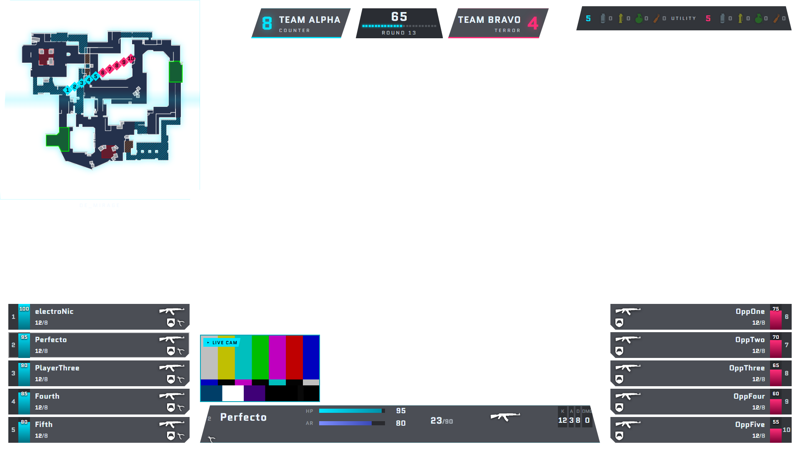
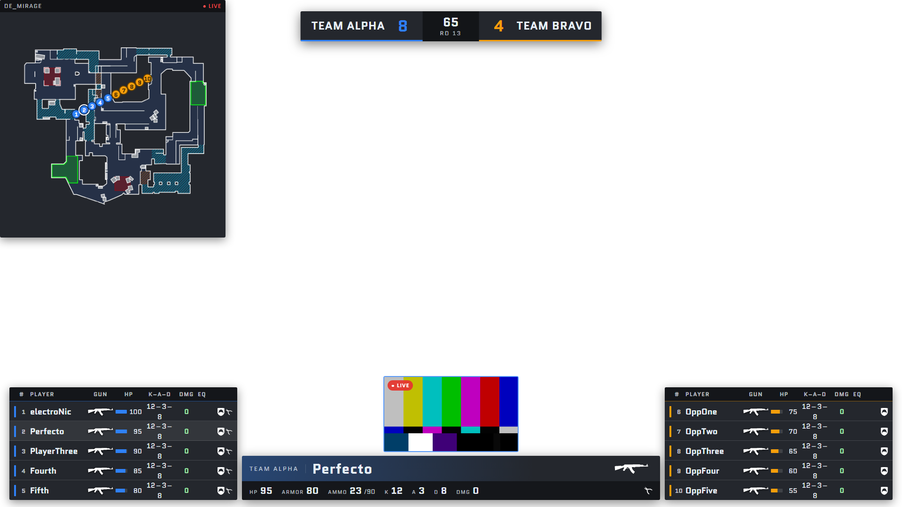
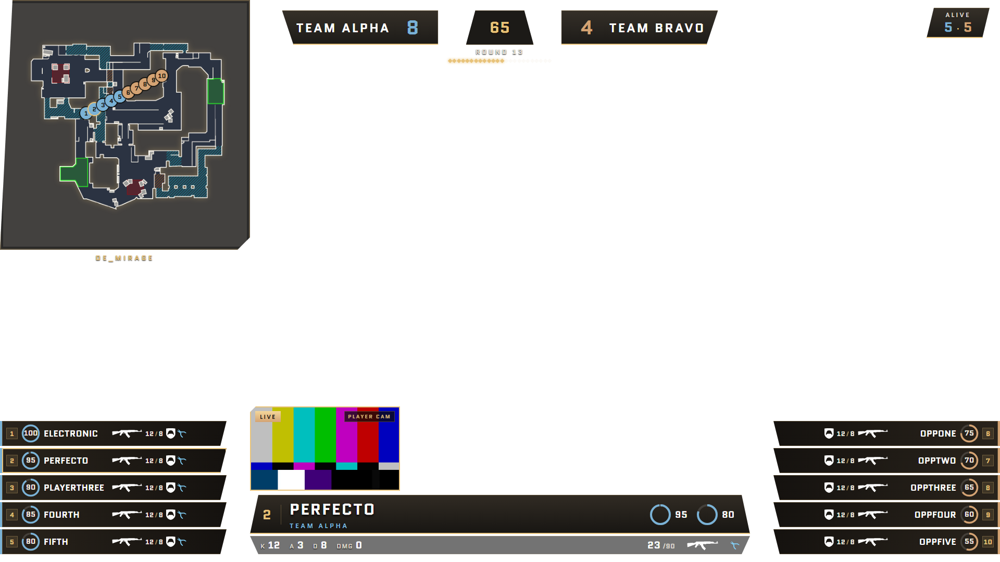
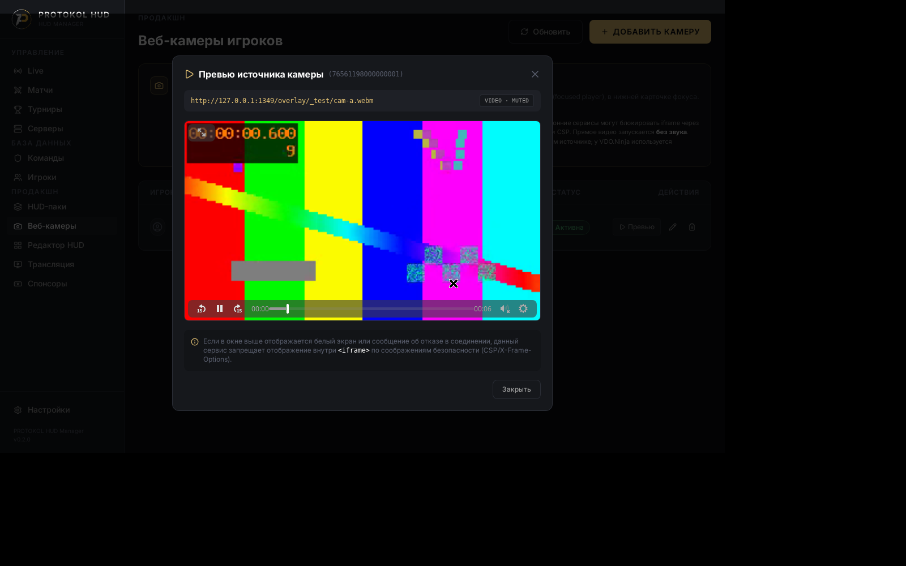
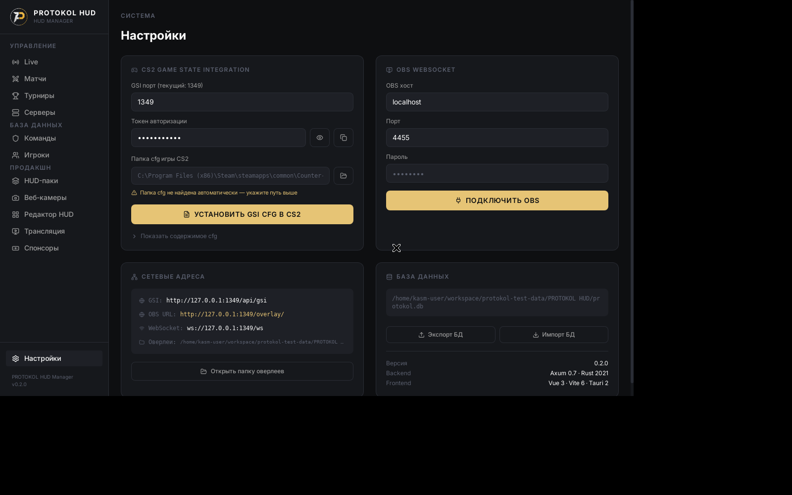

<div align="center">

# PROTOKOL HUD Manager

### Три самостоятельных турнирных HUD для CS2 + менеджер трансляций в одном нативном приложении

Tauri 2 · Vue 3 · Rust Axum · SQLite

[](LICENSE)
[](https://v2.tauri.app)
[](https://vuejs.org)
[](https://www.rust-lang.org)
[](#тесты)

</div>

---

## Три независимых турнирных HUD

Все три HUD построены на одном ядре данных (WebSocket + формула радара Eidetic) и одинаковом
расположении блоков классического бродкаста, но у каждого — собственный DOM, рендерер и CSS.
Пересечение классов между паками: **0.04–0.05 Jaccard** (проверяется автоматически).

| | **PROTOKOL Cyber** | **PROTOKOL Broadcast** | **PROTOKOL Championship** |
|---|---|---|---|
| Ростеры | Вертикальные HP-колонны: команда читается как «скайлайн» | Телевизионная таблица со строками статистики | Постаменты с SVG-циферблатами HP |
| Счёт | Капсулы команд + шкала раундов | TV-scorebug + экономическая полоса | Герб с лавровым таймером |
| Фокус игрока | Досье: ammo-лестница, K/D/A/ADR | Нижняя плашка lower-third | Табличка с радиальными циферблатами |
| Палитра | Неон | Эфирная | Золото/оникс |

<div align="center">

### PROTOKOL Cyber — вертикальная тактическая схема


### PROTOKOL Broadcast — телевизионный скорборд


### PROTOKOL Championship — церемониальный стиль мейджоров


</div>

## Веб-камеры игроков

Каждый HUD поддерживает реальные видеопотоки игроков (VDO.Ninja / WebRTC / HTML5 video),
привязанные к **SteamID64**. Камера фокус-игрока включается автоматически при переключении
спектатора, кадр не пересоздаётся на тиках GSI (видео не перезапускается), источники
валидируются: только `http(s)`, без учётных данных в URL.



## Менеджер

<div align="center">



</div>

| Модуль | Описание |
|---|---|
| **GSI-сервер** | Приём Game State Integration от CS2, раздача снапшотов и событий по WebSocket |
| **Оверлеи для OBS** | Хостинг на встроенном HTTP-сервере, Browser Source, импорт паков из ZIP |
| **Каталог** | Команды, игроки, матчи — CRUD в SQLite с WAL |
| **Веб-камеры** | Привязка потока к SteamID64, live-превью в менеджере, mute по умолчанию |
| **Безопасность** | GSI-токен, валидация URL источников, блокировка path traversal |

## Быстрый старт

```bash
git clone https://github.com/DangerousANEN/openhud-manager.git
cd openhud-manager
npm install
npm run tauri dev     # разработка
npm run tauri build   # релизный .exe / .deb
```

1. Запустите приложение — GSI-сервер поднимется на `http://127.0.0.1:1349`
2. На странице «Настройки» нажмите «Установить GSI cfg в CS2»
3. Скопируйте URL оверлея в OBS как Browser Source: `http://127.0.0.1:1349/overlay/fennec-broadcast/index.html`
4. Добавьте камеры игроков на вкладке «Веб-камеры» (SteamID64 + URL потока)
5. Запустите CS2 — данные и видео пойдут в оверлеи в реальном времени

## Тесты

| Сьют | Что проверяет | Статус |
|---|---|---|
| `cargo test --lib` | GSI-нормализация (round/bomb/weapons), паки, бандл — 36 тестов | ✅ 36/36 |
| `scripts/backend_e2e.py` | HTTP/GSI-аутентификация, WebSocket fan-out, path traversal — 33 проверки | ✅ 33/33 |
| `scripts/camera_e2e.py` | Реальное декодирование видео, переключение по SteamID, живучесть на тиках GSI, 3 разрешения × 3 HUD | ✅ |
| `scripts/hud_geometry.py` | Турнирные якоря (радар/счёт/ростеры/фокус) на 720p/1080p/1440p, отсутствие перекрытий, независимость DOM | ✅ |
| `scripts/championship_names_e2e.py` | Длинные ники в одну строку на всех разрешениях | ✅ |

```bash
cd src-tauri && cargo test --lib
python scripts/backend_e2e.py        # против запущенного сервера
python scripts/camera_e2e.py         # нужен Python + Playwright
```

## Документация

Полная документация — в [docs/](docs/): установка, GSI, редактор HUD, устранение неполадок.

## Лицензия

MIT — используйте свободно.
